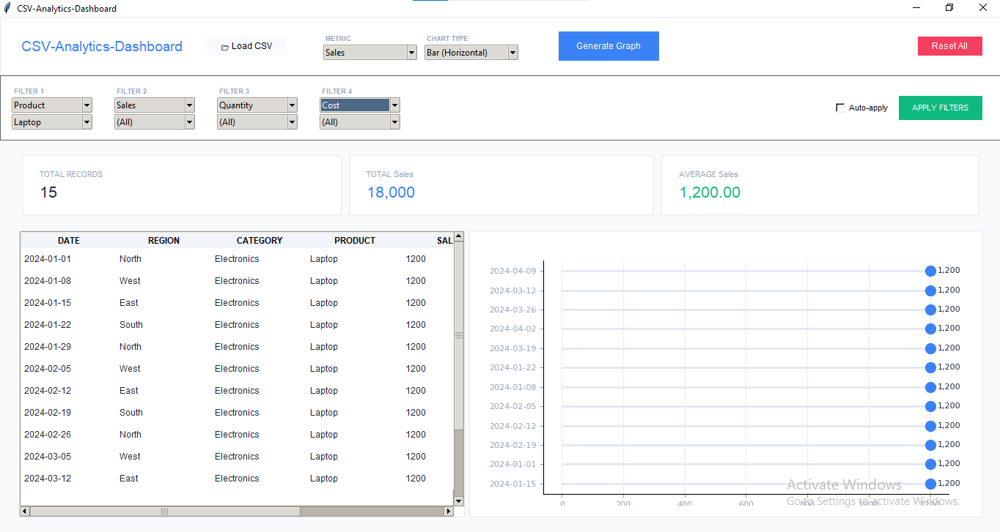

📊 CSV Analytics Dashboard (Enterprise BI Tool)

A modern desktop-based Business Intelligence (BI) application built using Python that enables users to load, explore, filter, and visualize CSV data with an enterprise-level interface inspired by tools like Power BI and Tableau.

🚀 Features
📂 Data Management
Load any CSV file instantly
Automatic column detection
Supports both numeric and categorical data
🎛️ Advanced Filtering System
Multi-level filtering (4 segment filters)
Dynamic dropdown updates based on data
Real-time dataset filtering
One-click reset filters option
📊 KPI Dashboard
Total records count display
Aggregated numeric insights
Dynamic KPI cards
Auto-updating metrics based on filters
📈 Advanced Data Visualization
📊 Modern Bar Charts (Top 15 ranking view)
📉 Smooth Area Charts for trends
📌 Lollipop Charts for comparisons
🔵 Scatter Plots for trend analysis
🧠 Smart Data Processing
Automatic grouping of categorical fields
Numeric aggregation (sum-based insights)
Optimized handling of large datasets
Top-N filtering for better performance
🎨 Professional UI Design
Enterprise-style dashboard layout
Clean card-based UI system
Modern color scheme and styling
Responsive pane-based structure
🛠️ Tech Stack
Python 🐍
Tkinter (GUI Framework)
Pandas (Data Processing)
Matplotlib (Data Visualization)
Tkinter.ttk (Modern UI Widgets)

👉 Desktop Application (Offline BI Dashboard)

